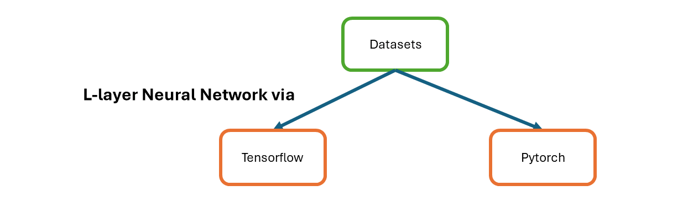
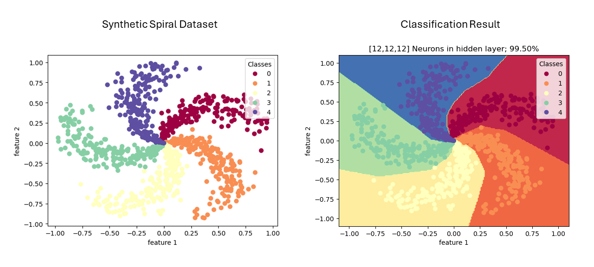
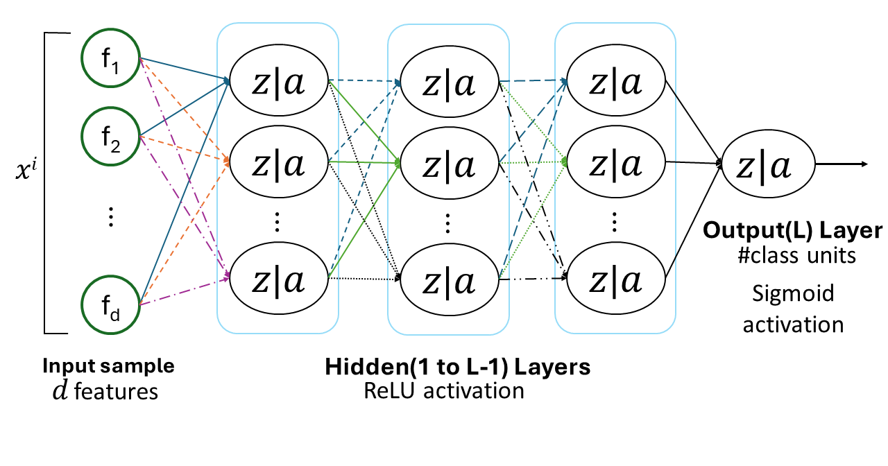

# p007-multiclass-classification-l-layered-neural-network

Using synthetic data, multiclass classification is done by "L" layers neural network; implemented in tensorflow and pytorch. In tensorflow/pytorch, different APIs are explored to implement dynamic layered algorithm. Input layer is not included in "L" layered neural network where 1 to L-1 layers have "ReLU" activation function and last layer i.e; L layer has "softmax" activation function. One-hot encoding of class labels is used.

 
 

 

Xavier Glorot uniform initializtion is used for dense/full connected layer using "softmax" and Kaiming He uniform initialization is used for layer using "ReLU" activation function. These use seed generators and pytorch, tensorflow have their own ones so thats why there is slight difference in result. In case of multiclass classification, output layer has neurons equal to number of classes.

